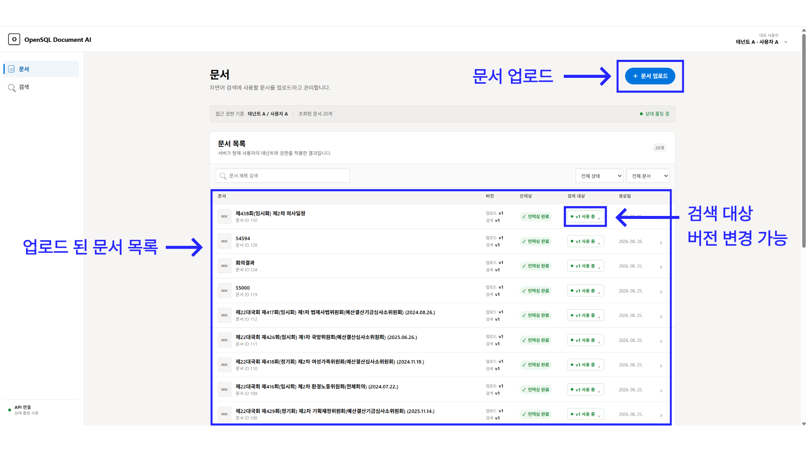
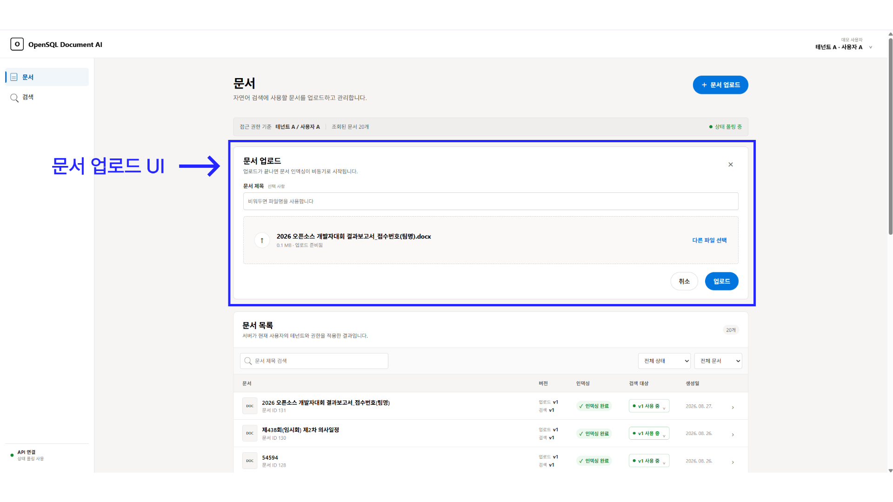
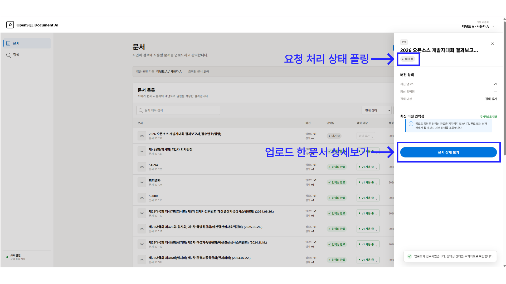
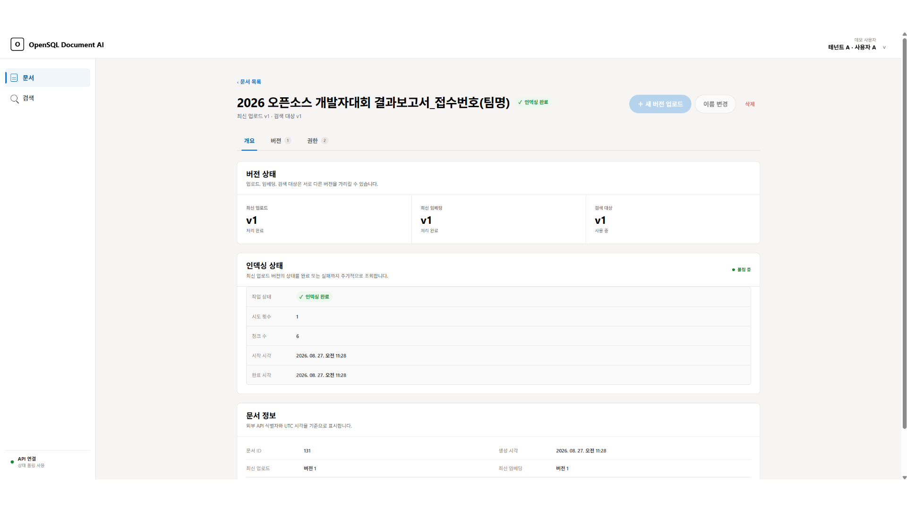
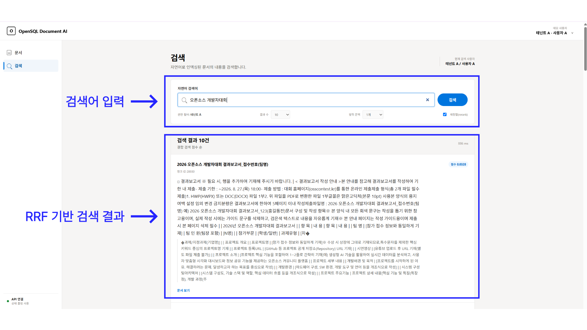

# OpenSQL Document AI

## 프로젝트 소개

OpenSQL Document AI는 문서를 업로드해 인덱싱 상태와 버전을 관리하고, 인덱싱된 문서 내용을 자연어로 검색하는 데모 웹 애플리케이션입니다. 데모 사용자를 바꿔 사용자·테넌트별 문서 접근 범위와 권한에 따른 화면 동작을 확인할 수 있습니다. 화면의 문서와 검색 결과는 연결된 API에서 가져옵니다.



## 주요 기능

- **데모 사용자 선택**: 사용자 A, B, C를 전환하고 선택한 사용자의 권한으로 문서 목록과 검색 결과를 조회합니다.
- **문서 업로드 및 관리**: PDF, DOCX, Markdown, HWP, TXT 파일을 최대 20MB까지 업로드하며, 제목 변경과 문서 삭제를 지원합니다.
- **문서 목록 및 상태 확인**: 제목, 인덱싱 상태, 검색 가능 여부로 문서를 필터링하고 다음 페이지를 불러올 수 있습니다. 진행 중인 인덱싱 상태는 완료 또는 실패까지 주기적으로 갱신됩니다.
- **문서 버전 관리**: 새 버전 업로드, 버전별 인덱싱 정보와 메타데이터 확인, 원본 다운로드, 실패한 인덱싱 재시도, 검색 대상 버전 변경을 지원합니다.
- **접근 권한 관리**: 문서에 대한 사용자·테넌트 단위의 읽기 또는 쓰기 권한을 확인하고, 쓰기 권한이 있으면 권한을 부여·변경·회수할 수 있습니다.
- **자연어 문서 검색**: 결과 수와 앞뒤 문맥 범위를 지정해 검색하고, 결과의 점수·페이지·섹션·본문 문맥을 확인한 뒤 원본 문서 상세로 이동할 수 있습니다.

## 사용 방법

1. **문서를 업로드합니다.**
   왼쪽의 `문서` 메뉴에서 `문서 업로드`를 누르고 파일을 선택하거나 끌어다 놓습니다. 제목은 선택 사항이며 비워 두면 파일명이 사용됩니다.

   

2. **인덱싱 상태를 확인합니다.**
   문서 목록에서 `대기 중`, `처리 중`, `재시도 대기`, `인덱싱 완료`, `실패` 상태를 확인합니다. 처리 중인 문서는 3초 간격으로 상태가 갱신됩니다. 목록은 제목, 상태, 검색 가능 여부로 필터링할 수 있습니다.

   

3. **문서와 버전을 관리합니다.**
   목록의 문서를 선택하면 요약이 열리고, `문서 상세 보기`에서 개요·버전·권한을 확인할 수 있습니다. 쓰기 권한이 있는 사용자는 새 버전 업로드, 이름 변경, 삭제, 실패한 버전 재시도, 완료된 버전의 검색 대상 지정, 접근 권한 관리를 수행할 수 있습니다.

   

4. **문서 내용을 검색합니다.**
   왼쪽의 `검색` 메뉴에서 자연어 검색어를 입력하고 결과 수와 앞뒤 문맥 개수를 선택합니다. 검색 결과에서 관련 내용, 점수, 페이지와 섹션 정보를 확인하고 `문서 보기`를 눌러 해당 문서 상세로 이동합니다.

   

## 실행 방법

### 요구 환경

- Node.js `^20.19.0` 또는 `>=22.12.0`
- npm
- 문서 관리 및 검색 API: 같은 origin에서 제공하거나 아래 환경변수로 주소를 지정해야 합니다.

### 의존성 설치

저장소 루트에서 잠금 파일을 기준으로 의존성을 설치합니다.

```bash
npm ci
```

### 환경변수 설정

API가 웹과 다른 origin에서 실행된다면 프로젝트 루트에 `.env.local`을 만들고 API 주소를 설정합니다.

```dotenv
VITE_API_BASE_URL=http://localhost:8080
```

같은 origin에서 API를 제공하는 경우 이 설정을 생략할 수 있습니다.

### 개발 서버 실행

```bash
npm run dev
```

터미널에 표시된 로컬 주소로 접속합니다.

### 빌드 및 미리보기

```bash
npm run build
npm run preview
```

빌드 결과는 `dist/`에 생성됩니다.

## 환경 변수

| 변수 | 설명 | 필수 여부 |
| --- | --- | --- |
| `VITE_API_BASE_URL` | 문서·검색 API의 base URL입니다. 마지막 `/`는 자동으로 제거되며, 설정하지 않으면 현재 웹 origin으로 요청합니다. | 조건부 — API가 다른 origin일 때 필요 |

모든 API 요청에는 화면에서 선택한 데모 사용자의 ID가 `X-User-Id` 헤더로 자동 전달됩니다.

## 기술 스택

| 영역 | 기술 |
| --- | --- |
| UI | React |
| 언어 | TypeScript |
| 개발 서버·빌드 | Vite, `@vitejs/plugin-react` |
| API 통신 | Fetch API, FormData, Blob |
| 스타일링 | CSS |
